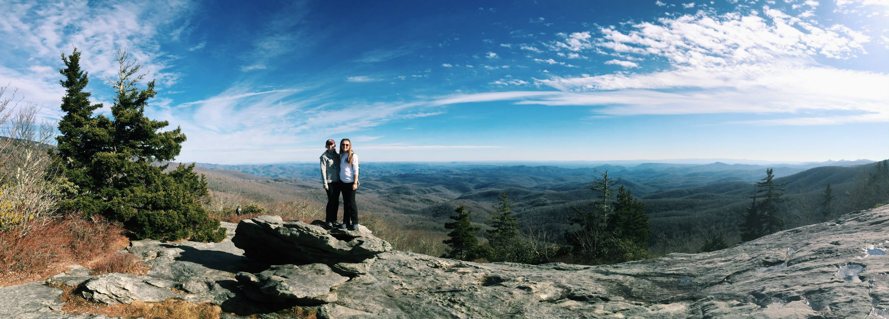

<hr> 

I originally created this site for my STT3530 Data Science course at Appalachian State University. In this course we used a combination of R, Data Camp, and Github to do some hands on learning that I thoroughly enjoyed. Although I have graduated and no longer attend Appalachian State, I enjoy keeping this website up to date with what's going on in my life. Throughout this site there is more information about me and the projects I've completed. Enjoy! 


```{r,echo=FALSE}



```